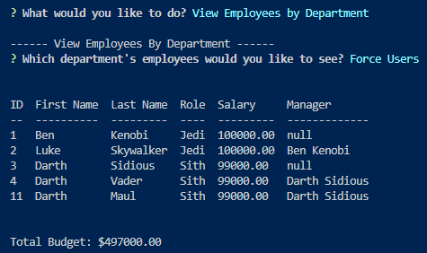

# Employee Tracker

[](https://unlicense.org)

## Description

Developers frequently have to create interfaces that allow non-developers to easily view and interact with information stored in databases. These interfaces are called content management systems (CMS). This project is a command-line application to manage a company's employee database.

The technologies used in this application are:
* [Node.js](https://nodejs.org/en/)
* [Inquirer](https://www.npmjs.com/package/inquirer/v/8.2.4) to prompt the user
* [MySQL](https://www.mysql.com/) to store the data
* [MySQL2 package](https://www.npmjs.com/package/mysql2) to connect to the MySQL database from Node.js
* [console.table package](https://www.npmjs.com/package/console.table) to print MySQL rows to the console
* [dotenv package](https://www.npmjs.com/package/dotenv) to store environmental variables 

### User Story

```md
AS A business owner
I WANT to be able to view and manage the departments, roles, and employees in my company
SO THAT I can organize and plan my business
```

### Acceptance Criteria

```md
GIVEN a command-line application that accepts user input
WHEN I start the application
THEN I am presented with the following options: view all departments, view all roles, view all employees, add a department, add a role, add an employee, and update an employee role
WHEN I choose to view all departments
THEN I am presented with a formatted table showing department names and department ids
WHEN I choose to view all roles
THEN I am presented with the job title, role id, the department that role belongs to, and the salary for that role
WHEN I choose to view all employees
THEN I am presented with a formatted table showing employee data, including employee ids, first names, last names, job titles, departments, salaries, managers that the employees report to, and the budget for the entire organization
WHEN I choose to add a department
THEN I am prompted to enter the name of the department and that department is added to the database
WHEN I choose to add a role
THEN I am prompted to enter the name, salary, and department for the role and that role is added to the database
WHEN I choose to add an employee
THEN I am prompted to enter the employee’s first name, last name, role, and manager, and that employee is added to the database
WHEN I choose to update an employee's role
THEN I am prompted to select an employee to update their role and this information is updated in the database
WHEN I choose to update an employee's manager
THEN I am prompted to select an employee to update their new manager and this information is updated in the database
WHEN I choose to view employees by manager
THEN I am presented with a formatted table showing employee data, including employee ids, first names, last names, job titles, departments, salaries, the manager that the employees report to, and the budget for that manager
WHEN I choose to view employees by department
THEN I am presented with a formatted table showing employee data, including employee ids, first names, last names, job titles, departments, salaries, the manager that the employees report to, and the budget for that department
WHEN I choose to delete a department, role, or employee
THEN I am presented with a list of either departments, roles, or employees to delete, with a conformation prompt, and then the data is removed from the database
```

## Table of Contents

- [Installation](#installation)
- [Usage](#usage)
- [License](#license)
- [Contributing](#contributing)
- [Questions](#questions)

## Installation

After downloading the source code, the package.json file should contain the following dependencies block:

```md
"dependencies": {
    "console.table": "^0.10.0",
    "dotenv": "^16.0.2",
    "inquirer": "^8.2.4",
    "mysql2": "^2.2.5"
  }
```

Run the following commands from the home directory.

```bash
npm i
```

Download MySQL Community Server from the [https://dev.mysql.com/downloads/mysql/](https://dev.mysql.com/downloads/mysql/) and install at least the server and the MySQL Shell.

From the `/db` folder, open the MySQL Shell and run `schema.sql` to build the database and `seeds.sql` to seed the data, if desired.

## Usage

The application will be invoked by using the following command:

```bash
npm start
```

Note `npm start` can be replaced with `node index.js` and the application will execute the same.

### Screenshots





[WEBM Video Link](https://drive.google.com/file/d/1FQ9jNMmgbkq8V2AyK4Sc-NJtMoyh-1Ql/view)
[MP4 Video Link](https://drive.google.com/file/d/1UadEbKtoUHaN6lneYRcU5Q-Y2zeUdPx1/view?usp=sharing)

## License

[](https://unlicense.org)

This application is covered under the [Unlicense](https://unlicense.org).

## Contributing

As this project is part of an individual assignment for the University of Denver's Coding Bootcamp, it would be inappropriate for anyone else to contribute to this project.

## Questions

GitHub Link: [https://github.com/dpk5e7](https://github.com/dpk5e7)

Please contact me at Daniel.Kelly@du.edu with any additional questions you may have.
